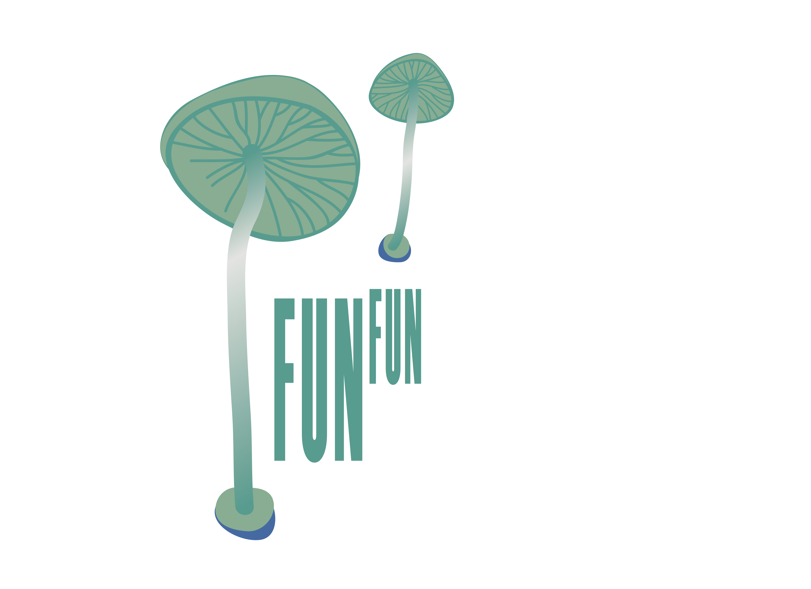

# fungaltraits aka fun<sup>fun</sup>: a dynamic functional trait database for the world's fungi

## How to use this package

#### Install the package

```r
install.packages("devtools")
devtools::install_github("ropenscilabs/datastorr")
devtools::install_github("traitecoevo/fungaltraits")
library(fungaltraits)
```

#### Access the fungal traits database

```r
fungal_traits()
```
This will download the data, and load it into R, and you're ready to do analyses.  The meta-data associated with the data is [in the zip file that can be downloaded here](https://github.com/traitecoevo/fungaltraits/releases).  

**If you use this package in a published paper, please note the version number**.  This  will allow others to reproduce your work later.  There is a Zenodo DOI associated with each release, insuring that it will be stable in the future.  

That's it, really.  Below is information about the data sources and the versioned data distribution system (which we think is really cool), feel free to check it out, but you don't need to read the rest of this to use the package.  

----------------------

### Data sources

-   Anderson, T. "Assessment of DNA contents of soil fungi." Landbauforschung Volkenrode 58.1/2 (2008): 19.

-   Bässler, Claus, et al. "Ectomycorrhizal fungi have larger fruit bodies than saprotrophic fungi." Fungal Ecology 17 (2015): 205-212.

-   Crowther, Tom and D. Maynard. Unpublished.

-   Grigoriev, Igor V., et al. "MycoCosm portal: gearing up for 1000 fungal genomes." Nucleic Acids Research (2013): gkt1183.

-   Mouginot, Céline, et al. "Elemental stoichiometry of Fungi and Bacteria strains from grassland leaf litter." Soil Biology and Biochemistry 76 (2014): 278-285.

-   Nguyen, Nhu H., et al. "FUNGuild: an open annotation tool for parsing fungal community datasets by ecological guild." Fungal Ecology 20 (2016): 241-248.

-   Powell,. Unpublished.

-   Schlussler,. Unpublished.

-   Schoch, Conrad L., et al. "The Ascomycota tree of life: a phylum-wide phylogeny clarifies the origin and evolution of fundamental reproductive and ecological traits." Systematic biology (2009): syp020.

-   Talbot, Jennifer M., et al. "Functional guild classification predicts the enzymatic role of fungi in litter and soil biogeochemistry." Soil Biology and Biochemistry 88 (2015): 441-456.

-   Talbot, Jennifer M. Unpublished.

-   Tedersoo, Leho, and Matthew E. Smith. "Lineages of ectomycorrhizal fungi revisited: foraging strategies and novel lineages revealed by sequences from belowground." Fungal biology reviews 27.3 (2013): 83-99.

-   Treseder, Kathleen K., et al. "Experimental warming alters potential function of the fungal community in boreal forest." Global change biology (2016).



## Fun<sup>fun</sup> DB governance:

**Endophytes:**

- [Michelle Afkhami](https://michelleafkhami.wordpress.com/) (afkhami@bio.miami.edu)
- Posy Busby (posy.busby@oregonstate.edu)
- [Natalie Christian](www.nataliechristian.com) (nschrist@indiana.edu)

**Genes and Chemistry:**

- Dimitri Floudas (dfloudas@gmail.com)
- Jennifer Talbot (jmtalbot@bu.edu)
- Kathleen Treseder (treseder@uci.edu)

**Guilds:**

- Scott Bates (scott.thomas.bates@gmail.com)
- [Peter Kennedy](https://cbs.umn.edu/kennedy-lab/home) (kennedyp@umn.edu)

**Mycorrhizae:**

- [Peter Kennedy](https://cbs.umn.edu/kennedy-lab/home) (kennedyp@umn.edu)
- [Jeff Powell](https://www.westernsydney.edu.au/hie/people) (Jeff.Powell@westernsydney.edu.au)

**Pathogens:**

- Carlos Aguilar (calgit@gmail.com)
- [Dan Lindner](https://www.nrs.fs.fed.us/people/dlindner) (dlindner@fs.fed.us)

**Saprobes:**

- Amy Milo (amymmilo@gmail.com)
- [Jonathan Schilling](http://schillinglab.cfans.umn.edu/) (schillin@umn.edu)


**Taxonomy:**

- Dimitri Floudas (dfloudas@gmail.com)
- Romina Gazis (gazisromina@gmail.com)
- David Hibbet (DHibbett@clarku.edu)

**Database:**

- Will Cornwell (w.cornwell@unsw.edu.au)
- [Habacuc Flores-Moreno](http://habacucfm.github.io/) (hfloresm@umn.edu)
- Amy Zanne (aezanne@gmail.com)

## Notes for making a release using this *living dataset* design

*This is for database maintainers*

* Update the `DESCRIPTION` file to **increase** the version number.  Once we are past version 1.0.0, we will use [semantic versioning](http://semver.org/) so be aware of when to change what number.
* Rebuild `funtothefun.csv` and `funtothefun.zip` making whatever improvements/fixes are necessary
* Commit data and code changes and `DESCRIPTION` and push to GitHub
* With R in the package directory, run
```r
fungaltraits:::fungal_traits_release("<description>")
```
where `"<description>"` is a brief description of new features of the release.
